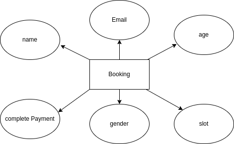
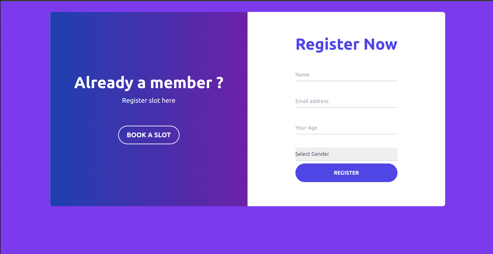
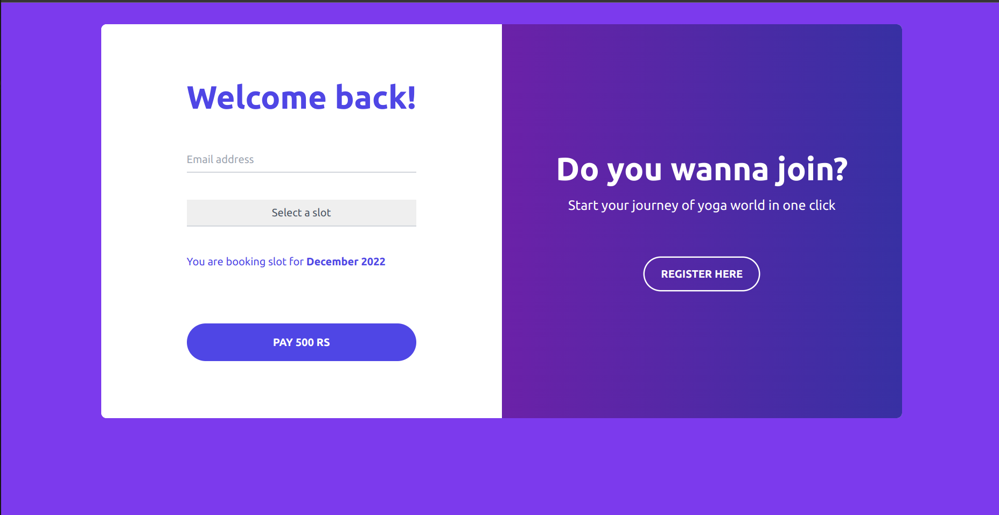

# Yoga Registration

## Problem Statement:

Assume that you are the CTO for the outsourcing firm which has been chosen to build an
admission form for the Yoga Classes which happen every month.
Requirements for the admission form are:

- Only people within the age limit of 18-65 can enroll for the monthly classes and they will be paying the fees on a month on month basis. I.e. an individual will have to pay the fees every month and he can pay it any time of the month.
- They can enroll any day but they will have to pay for the entire month. The monthly fee is
  500/- Rs INR.
- There are a total of 4 batches a day namely 6-7AM, 7-8AM, 8-9AM and 5-6PM. The participants can choose any batch in a month and can move to any other batch next
  month. I.e. participants can shift from one batch to another in different months but in same month they need to be in same batch

## Features

1. User can Register anytime
2. User can only pay for current month
3. User can book a slot
4. User can Pay 500 rs on booking slot.
5. User can only pay after registration.

## Technology Stack:

      

- **Frontend**: React
- **Backend**: Django, Django Rest Framework
- **IDE**: VS Code
- **Version Control**: Git and GitHub
- **Database**: SQLite
- **Hosting**: render(not deployed)

### How to Get Started?

#### GitHub Repository Structure

| S.No. | Branch Name                                                         | Purpose                    |
| ----- | ------------------------------------------------------------------- | -------------------------- |
| 1.    | [frontend](https://github.com/ParthSharmaT/yoga_app_api)            | contains all Frontend code |
| 2.    | [backend](https://github.com/ParthSharmaT/yoga_app_api/tree/master) | contains all Backend code  |

### Frontend Setup Instructions

- Fork and Clone the repo using

```
$ git clone https://github.com/ParthSharmaT/yoga_app_api
```

- Install the Dependencies from `npm`

```
$ npm i
```

- Run the Server

```
$ npm start
```
### ER Diagram

### Demo Screens
Register:

Payment:

# License :memo:

This project follows the [MIT License](https://choosealicense.com/licenses/mit/).

[](https://github.com/ParthSharmaT/yoga_app_api)
[](https://github.com/ParthSharmaT/yoga_app_api)
[](https://github.com/ParthSharmaT/yoga_app_api)
[](https://github.com/ParthSharmaT/yoga_app_api)
